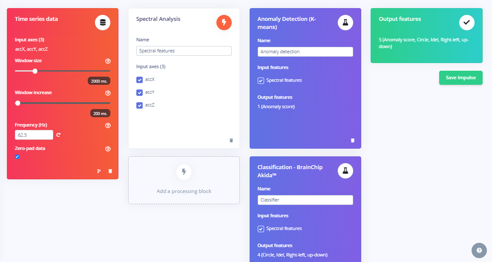
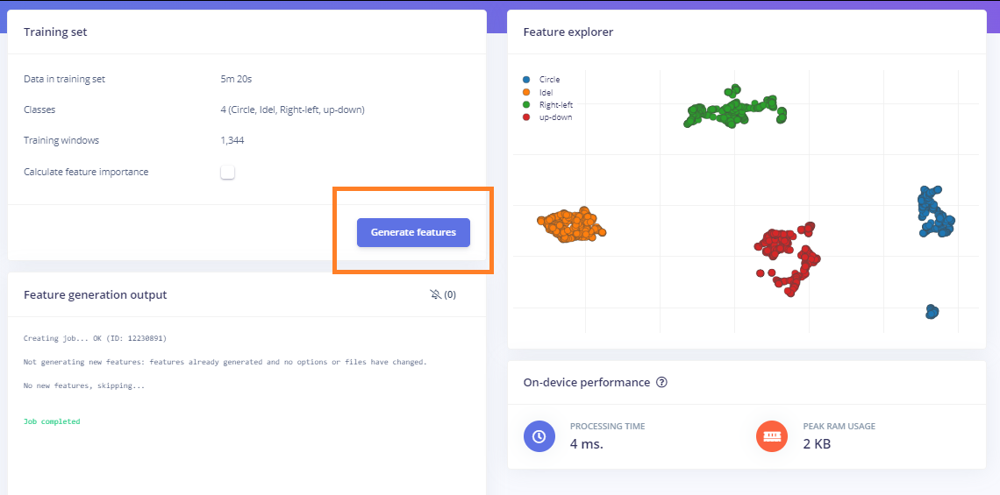
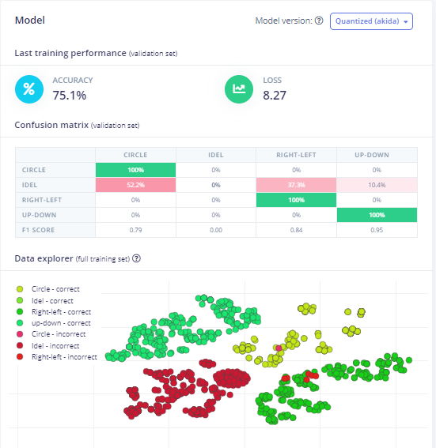
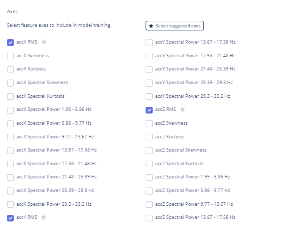
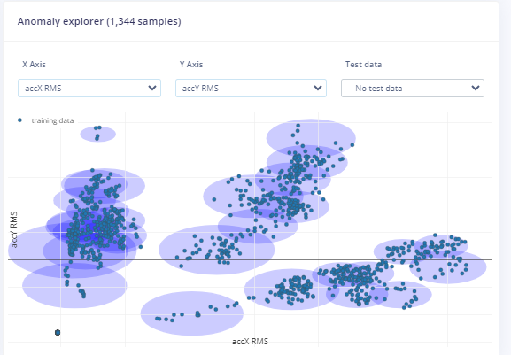
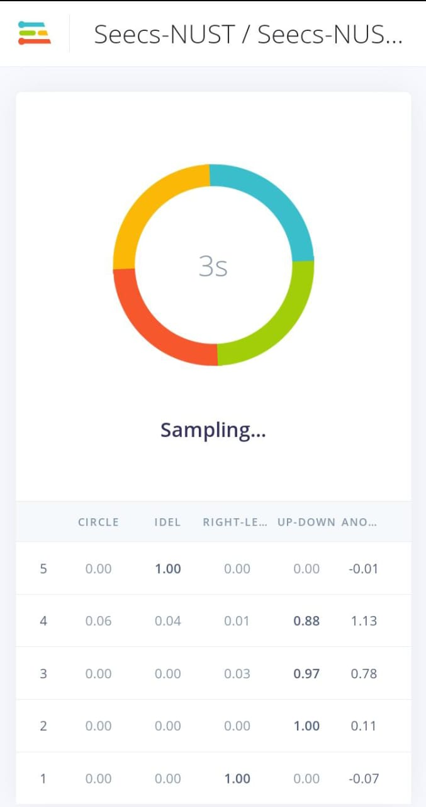

# Motion Detection using Machine learning on Edge Impulse
The repo contains the implementation of a motion detection device that detects the up-down, right-left, circular and idle motion of the target machine i.e. mobile phone or any [supported board](https://docs.edgeimpulse.com/docs/development-platforms/fully-supported-development-boards) 
## Data Collection
Connect your phone to the Edge Impulse platform

once your phone is connected start collecting by clicking starting recording on your phone

  
  &nbsp;&nbsp;&nbsp;&nbsp;&nbsp;
  
  &nbsp;&nbsp;&nbsp;&nbsp;&nbsp;
  

Now shake your phone right-left 10 to 20 times and do the same for up-down and circular motion. For idleness leave your phone and on a plane desk and then record.
Your data will appear in the Data Acquisition section don't forget to label your data.

## Feature Extraction
Head to the Impulse design page in your project. Add a <b>Spectral Analysis</b> processing block. Add a <b>Classification-BrainChip Akida</b> and a <b>K-means Anomaly Detection</b> block to the learning blocks section.

After saving impulse head on to the spectral features and generate features.

## Model Training
Head to the <b>Classification-BrainChip Akida</b> page in your project. Click Start Training. After a few minutes, the model should be done training. Now you can monitor the accuracy of the Model<be>

    

Now go to the Anomaly detection page and select the features to train. I have selected RMS values of acceleration along the x, y, and z axis.

  &nbsp;&nbsp;&nbsp;&nbsp;&nbsp;
  
  &nbsp;&nbsp;&nbsp;&nbsp;&nbsp;
  
  &nbsp;&nbsp;&nbsp;&nbsp;&nbsp;

## Model Deployment
Go to the <b>Deployment Page</b> and Scan the <b>QR code<b> using your phone.<be>

    

The model predicts the probability of the state of the device. If the device is idle the probability of idle will be one and same goes for the up-down, right-left and circular motion.
