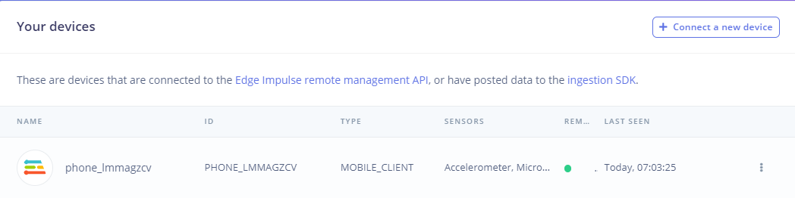
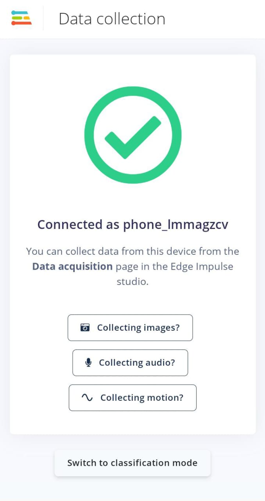
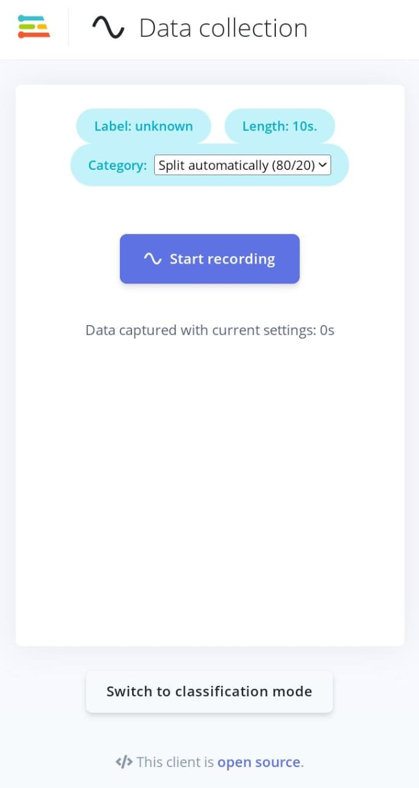
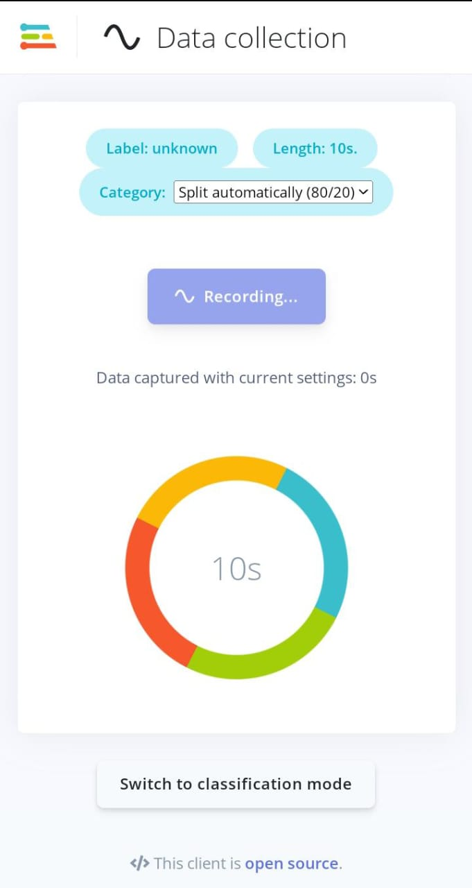
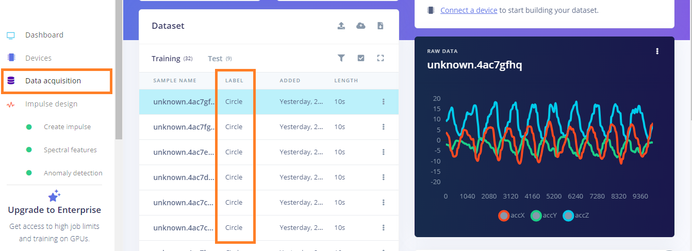

# Motion Detection using Machine learning on Edge Impulse
The repo contains the implementation of a motion detection device that detects the up-down, right-left, circular and idel motion of the target machine i.e. mobile phone or any [supported board](https://docs.edgeimpulse.com/docs/development-platforms/fully-supported-development-boards) 
## Data Collection
Connect your phone to the Edge Impulse platform

once your phone is connected start collecting by clicking starting recording on your phone

  
  &nbsp;&nbsp;&nbsp;&nbsp;&nbsp;
  
  &nbsp;&nbsp;&nbsp;&nbsp;&nbsp;
  

Now shake your phone right-left 10 to 20 times and do the same for up-down and circular motion. For idleness leave your phone and on a plane desk and then record.
Your data will appear in the Data Acquisition section don't forget to label your data.

## Feature Extraction
Head to the Impulse design page in your project. Add a <b>Spectral Analysis</b> processing block. Add a Classification-BrainChip Akida and a K-means Anomaly Detection block to the learning blocks section.
